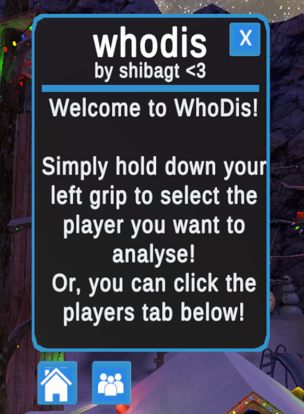
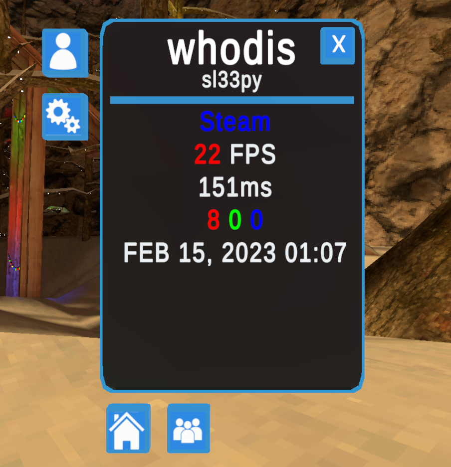
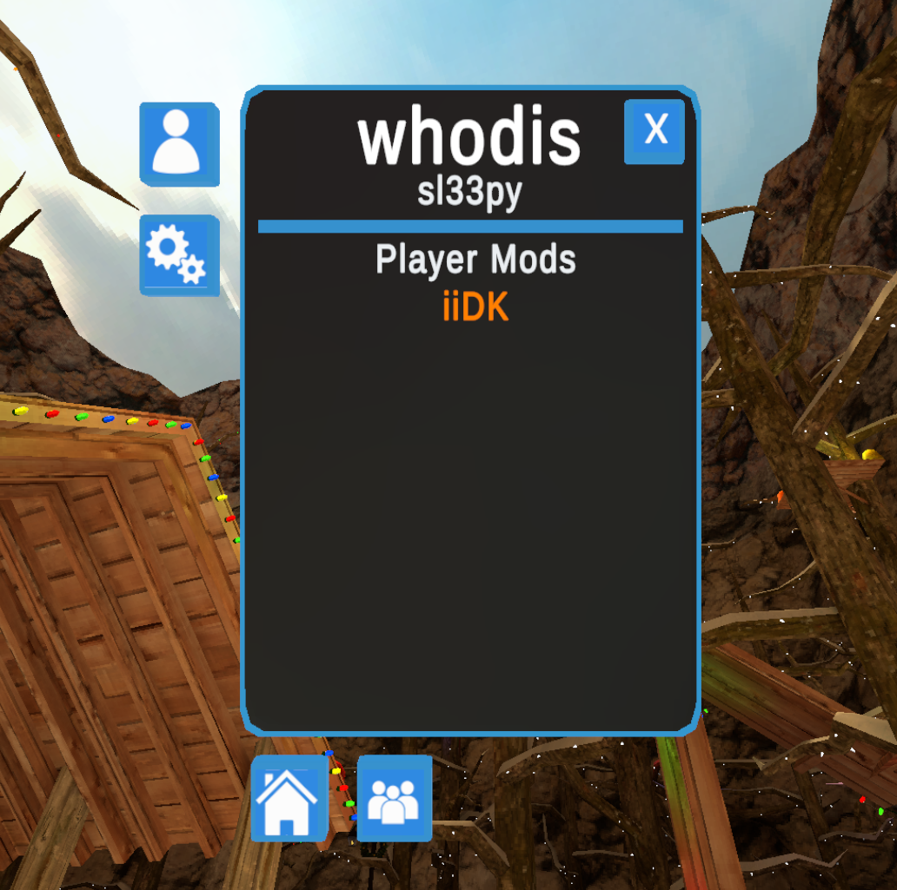
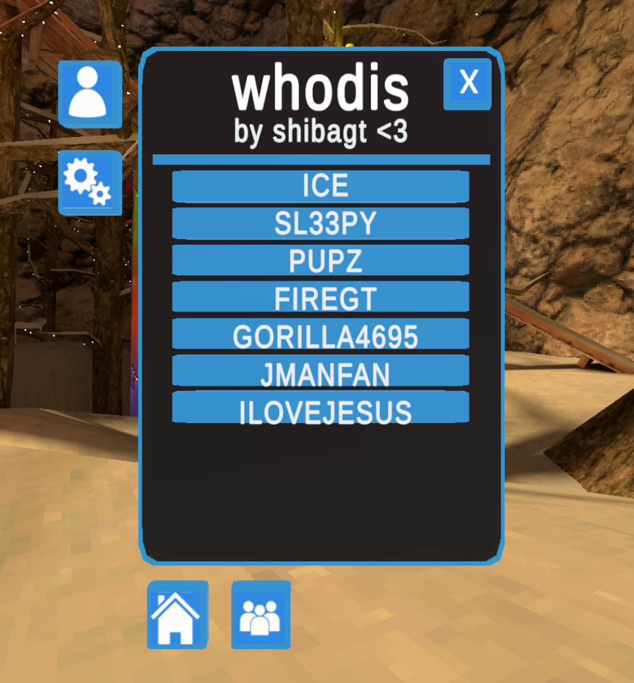

# 🕵️‍♂️ WhoDis
lowkey #looking 👀👀👀👀

A **simple, clean Gorilla Tag mod** that lets you inspect players in game and view detailed information about them with just a click.

---

## ✨ Features

* 🔍 Click on players to instantly view their info
* 📊 Displays player data in a **compact, smaller info panel** including:
  * **Name**
  * **Color**
  * **FPS**
  * **Ping**
  * **Mods Installed**
  * **Account Creation Date**
* 🧭 Built-in **Players tab** inside the WhoDis panel (no need to click players if you want)
* 🎮 Fast player selection
* 🧼 Minimal, space-efficient UI

---

## 🎮 Controls

* **Open & Close Menu (optional):**
  Press **left bottom face button** on your controller to open, Press **right bottom face button** on your controller to close

* **Quick Select Player:**
  Hold **Left Grip** + press **Left Trigger** while pointing at a player
  → Automatically opens the WhoDis menu with that player selected

---

## 🧩 Player Selection Methods

You can choose how to inspect players:

* **Gun selection** – click directly on a player
* **Menu-based selection** – select players from the **Players tab** inside the WhoDis panel

Both methods show the same detailed information.

---

## 🖼️ Screenshots

<table>
  <tr>
    <td align="center">
      
       <b>Home</b>
    </td>
    <td align="center">
      
       <b>Selected Player</b>
    </td>
  </tr>
  <tr>
    <td align="center">
      
       <b>Installed Mods</b>
    </td>
    <td align="center">
      
       <b>Players List</b>
    </td>
  </tr>
</table>

---

## ⚠️ Notes

* Could be buggy as this is the first project like this I've made
* Designed for simplicity and speed
* Information shown depends on what data is available in-session
* Made for Gorilla Tag modding environments

---

**WhoDis**, *because sometimes you just wanna know.* 👀
